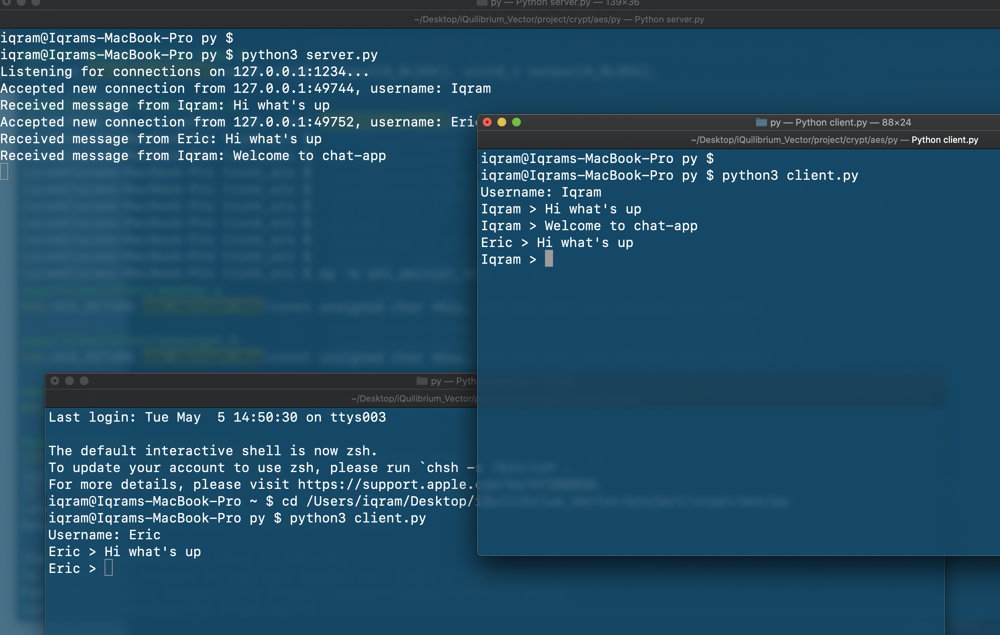

# Chat-App
Python chat application (multi)client-server model

# This is simple chat application implemented in Python3 using TCP/IP

You can have multiple clients connecting to the server. The above program runns in you local host i.e 127.0.0.1
Underneat it use the standard Unix select() function.

## How to run the program?

```
python3 server.py
python3 client.py
```

For a server using 0.0.0.0 means to listen on all available interfaces, useful to connect locally to 127.0.0.1 and
remotely to LAN interface IP

### Information about server.py

    1. Create a socket
    2. socket.AF_INET - address family, IPv4, some otehr possible are AF_INET6, AF_BLUETOOTH, AF_UNIX
    3. socket.SOCK_STREAM - TCP
    4. Bind, so server informs operating system that it's going to use given IP and port
    5. List of sockets for select.select()
    6. List of connected clients - socket as a key, user header and name as data

-------------

### Information about client.py

    1. You create a socket
    2. socket.AF_INET - address family, IPv4, some otehr possible are AF_INET6, AF_BLUETOOTH, AF_UNIX
    3. socket.SOCK_STREAM - TCP, conection-based, socket.SOCK_DGRAM - UDP, connectionless, datagrams, socket.SOCK_RAW - raw IP       packets
    4. Connect to a given ip and port
    5. Set connection to non-blocking state, so .recv() call won;t block, just return some exception we'll handle
    6. Prepare username and header and send them
    
  
  ### Chat-App CLI output
  
  <p align="center"></p>
